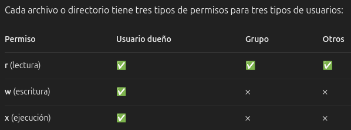

- # 5.Permisos y usuarios en Linux
    Los permisos y usuarios juegan un papel fundamental en la seguridad y gestión del sistema de archivos.
    - *Usuarios:* Cada persona o proceso en Linux tiene una cuenta de usuario.
    - *Grupos:* Conjunto de usuarios que comparten permisos sobre archivos y directorios.
- ## 5.1.Comandos útiles
    - `whoami` → Muestra el usuario actual.
    - `id` → Muestra el UID (ID de usuario) y GID (ID de grupo).
    - `groups usuario` → Muestra los grupos a los que pertenece un usuario.
    - `adduser usuario` → Crea un nuevo usuario.
    - `deluser usuario` → Elimina un usuario.
    - `usermod -aG grupo usuario` → Agrega un usuario a un grupo.
    - `groupadd grupo` → Crea un grupo.
    - `groupdel grupo` → Elimina un grupo.
    - `passwd` → Cambia contraseña del usuario actual.
    - `passwd usuario` → Cambia contraseña del usuario especificado.
    - `chown usuario archivo` → Cambia el dueño de un archivo/directorio.
    - `su` → Cambia de usuario (por defecto cambia a root).
    - `sudo` → Ejecuta comandos como root.
- ## 5.2.Archivos útiles
    - `/etc/shadow`: Archivo que guarda las contraseñas cifradas y configuraciones de expiración de cuenta. Solo accesible por root.
    - `/etc/passwd`: Este archivo contiene información básica sobre todos los usuarios del sistema.
    - `/etc/group`: Este archivo contiene la información de todos los grupos en el sistema.
    - `/etc/sudoers`: Archivo para configurar permisos sudo.
- ## 5.3.Permisos en Linux

    **chmod** significa Change Mode, y se usa para cambiar los permisos de lectura, escritura y ejecución para:
    - El usuario (dueño): u
    - El grupo: g
    - Los otros (everyone else): o
- ### 5.3.1.Modo simbólico
    `chmod u/g/p +- x/w/r nombreArchivo`
- ### 5.3.2.Modo numérico
    r→4
    w→2
    x→1
    `chmod ### nombreArchivo`
- ### 5.3.3.Permisos en directorios
    r → Puedes ver qué contiene (ls)
    w → Puedes crear o borrar archivos dentro
    x → Puedes entrar al directorio (cd)
- ### 5.3.4.chgrp
    Cambia grupo de archivo
    `chgrp nombreGrupo archivo`
- ### 5.3.5.umask
    Significa "user file creation mask" (máscara de creación de archivos).
    Sirve para restar permisos por defecto cuando creas archivos o carpetas.
    Cuando se crea:
    - Un archivo, el sistema propone: 666 (lectura y escritura para todos)
    - Un directorio, el sistema propone: 777 (lectura, escritura y ejecución para todos)
    Pero… el sistema le resta la umask.
    Para ver la umask:
    `umask`
    Modificar umask temporalmente:
    `umask ###`